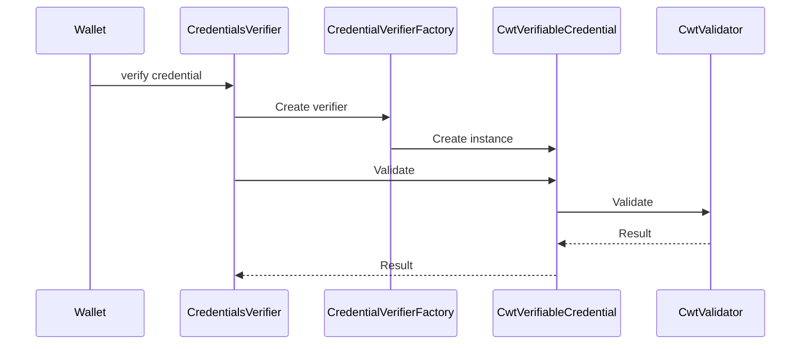
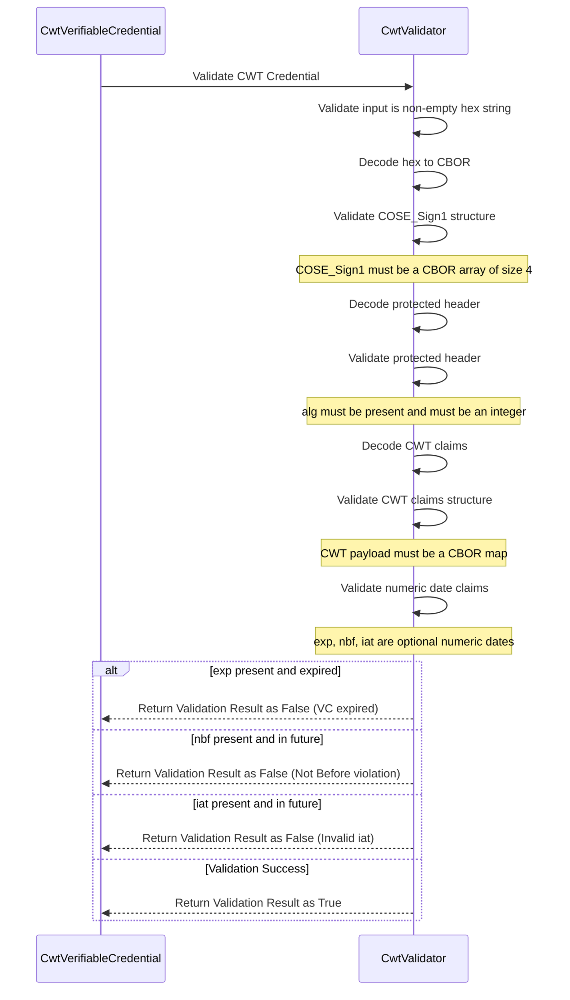
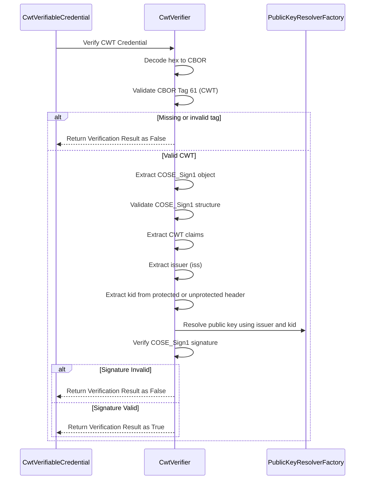

# Support for IETF CWT Verifiable Credential (CWT-VC)

This document provides a comprehensive overview of validating and verifying **CWT-based Verifiable Credentials (cwt-vc)** encoded using **CBOR Web Token (CWT)** and **COSE_Sign1**, as defined by IETF standards.

---

## Public key resolution support

- **HTTP / HTTPS Issuer**
  - Retrieves issuer public key from `/.well-known/jwks.json` when `iss` is an HTTP(S) URL.

---

## Steps Involved

1. Add enum value `CWT_VC("cwt-vc")` in `CredentialFormat`.
2. Create a new class `CwtVerifiableCredential` that implements the `VerifiableCredential` interface.
   - `validate` method validates credential structure and claims.
   - `verify` method verifies cryptographic signature.
3. Create a class `CwtValidator` to validate credential structure and claims.
4. Create a class `CwtVerifier` to verify the credential signature.
5. Implement validation checks for COSE, headers, claims, and numeric dates.
6. Implement signature verification using issuer public key.
7. Register `CwtVerifiableCredential` in `CredentialVerifierFactory`.

---

## Sequence diagram – validate and verify `cwt-vc` credential

### Sequence diagram - validation process

### Sequence diagram - verification process

---

## Key Validation Rules Summary

### COSE Structure
- Must be a CBOR array of exactly 4 elements.

### Protected Header
- `alg` MUST be present and an integer.

### CWT Claims
- Payload MUST be a CBOR map.
- `iss`, `exp`, `nbf`, `iat` validated as per spec.

### Cryptographic Verification
- CBOR tag `61` required.
- Signature verified using COSE_Sign1.

---
